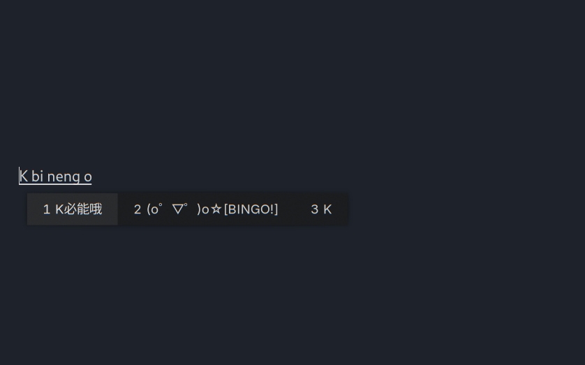

# 草师傅的 rime 配置



基于[雾凇拼音](https://github.com/iDvel/rime-ice)的 rime 配置（补丁），为小鹤双拼用户提供特别优化。

需要先行安装 Rime 以及加载好 雾凇拼音 的配置，参考：[雾凇拼音的使用说明](https://github.com/iDvel/rime-ice?tab=readme-ov-file#使用说明)

---

## 更改列表

几乎一切都是通过补丁实现的，你可以快速编辑相应的 custom.yaml 来调整这些更改

- 添加颜文字候选、K+表情描述反查颜文字（[#463](https://github.com/iDvel/rime-ice/pull/463)）
- 自用扩展词库
  - [每月更新的 rime userdb](./gdict/cybernet.yaml)（使用[rime-dict-tools](https://codeberg.org/grassblock/rime-dict-tools) 转换、去重，并人工修订），包含大量互联网词汇
  - [部分常用词](./gdict/427.dict.yaml)
  - [Minecraft 词库](https://github.com/Kimiblock/rime-minecraft-dict)
- [双拼补丁](https://github.com/iDvel/rime-ice/issues/133)（默认只给小鹤添加了，可以按需要修改成其它方案）
- [（可选的）自动纠错](https://github.com/iDvel/rime-ice/issues/838)，若要使用直接取消掉注释即可
- 一套基于 [Nord](https://nordtheme.com) 的小狼毫主题（比较古早所以我不确定还能不能用）

## 使用

1. Git

（如果此前在雾凇拼音也使用这个方法配置，那么不建议使用这个办法）

直接克隆仓库

```shell
git clone https://github.com/GrassBlock1/rime_config /path/to/rime_config
```

如果国内无法正常访问，可以使用镜像：

```shell
git clone https://codeberg.org/grassblock/rime /path/to/rime_config
```

2. 直接下载 zip
   - GitHub： 绿色的 Code > Download zip  |   🔗 [下载链接](https://github.com/Grassblock1/rime_config/archive/refs/heads/main.zip)
   - Codeberg： ··· > 下载 zip  |  🔗 [下载链接](https://codeberg.org/grassblock/rime/archive/master.zip)

将**rime-master（或者 rime/master）中的文件**解压到 rime 的配置目录即可。

## 特别感谢

以下排名不分先后：

[rime-ice: Rime 配置：雾凇拼音 | 长期维护的简体词库](https://github.com/iDvel/rime-ice) | @idvel | [GPL-3.0](https://github.com/iDvel/rime-ice/blob/main/LICENSE) ： 配置方案的基底

[rime-minecraft-dict: Minecraft dict for Rime](https://github.com/Kimiblock/rime-minecraft-dict) | @kimiblock | [GPL-2.0](https://github.com/Kimiblock/rime-minecraft-dict/blob/master/LICENSE)： Minecraft 词库

## 许可证

GNU Affero General Public License v3.0, refer to [LICENSE](./LICENSE) for more information.

	Copyright (C) 2024  GrassBlock
	
	This program is free software: you can redistribute it and/or modify
	it under the terms of the GNU Affero General Public License as published by
	the Free Software Foundation, either version 3 of the License, or
	(at your option) any later version.
	
	This program is distributed in the hope that it will be useful,
	but WITHOUT ANY WARRANTY; without even the implied warranty of
	MERCHANTABILITY or FITNESS FOR A PARTICULAR PURPOSE.  See the
	GNU Affero General Public License for more details.
	
	You should have received a copy of the GNU Affero General Public License
	along with this program.  If not, see <https://www.gnu.org/licenses/>.